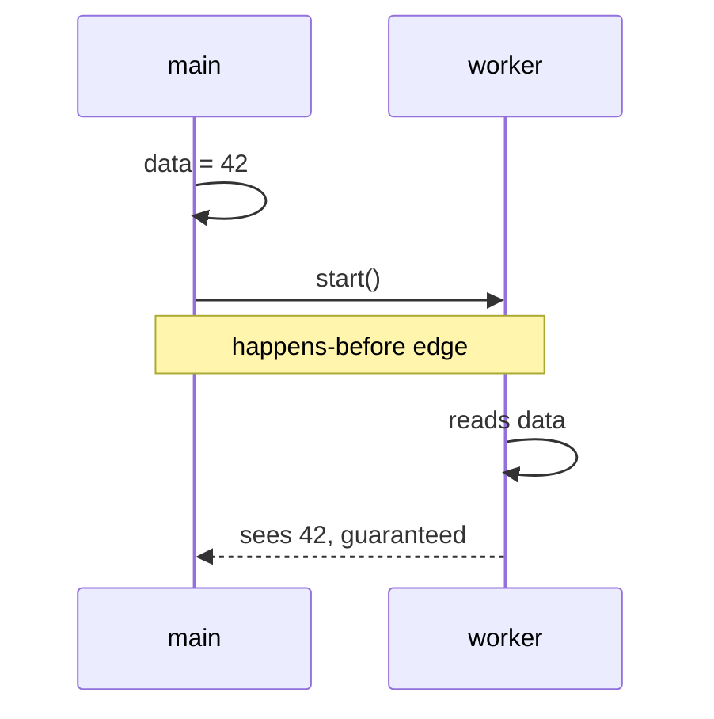
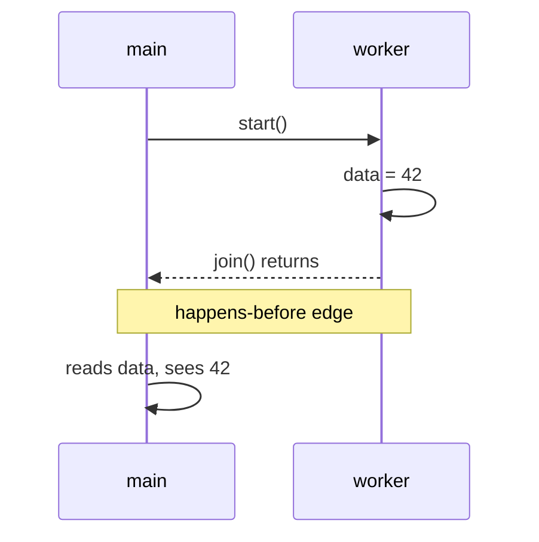
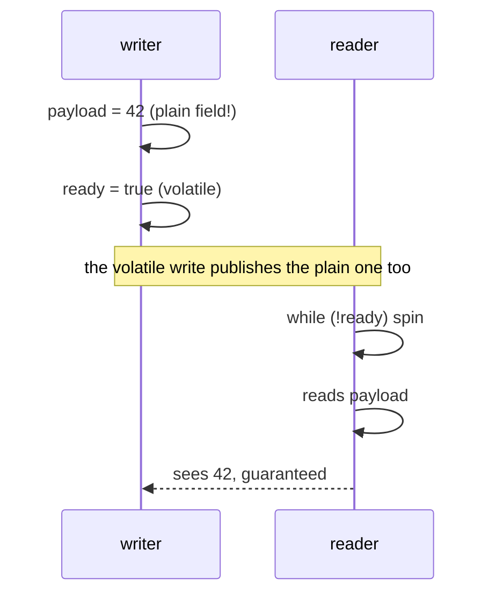
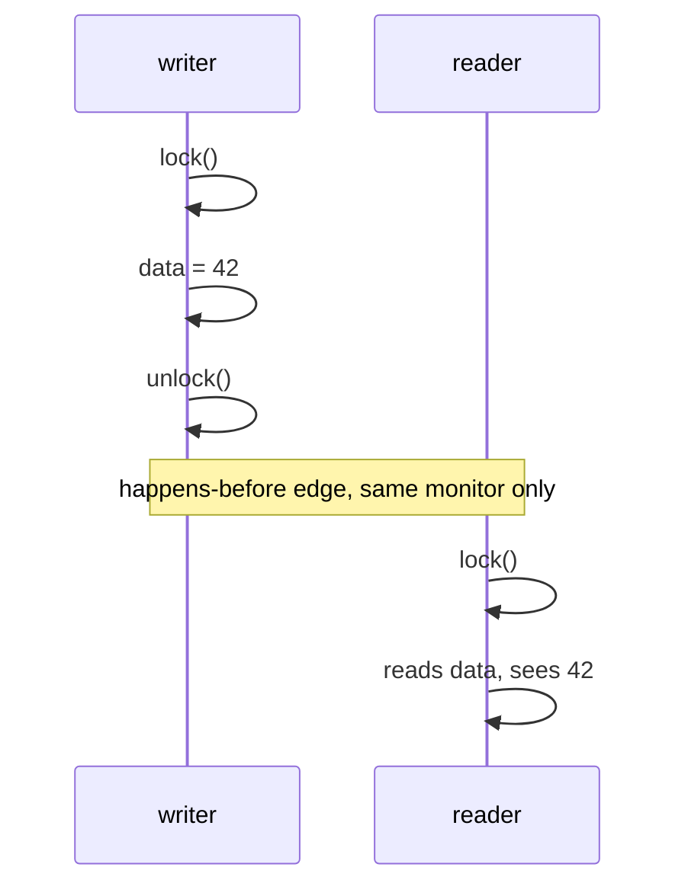
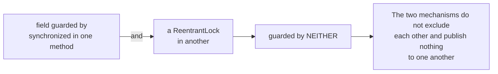

# Happens-before: the four edges you get for free

If a write happens-before a read, the read **must** see that write. If no edge exists, the read may
see it, may see a stale value, or may see actions in a different order than the source lists them.

Four edges arrive without any special effort.

## 1. Thread.start()

Everything the starting thread did before `start()` is visible inside the new thread.

## 2. Thread.join()

Everything the joined thread did is visible after `join()` returns.

This is the edge that lets the tests here read a counter after joining its writers without
synchronising the read. Worth recognising, so you stop adding `volatile` to fields that already
have an edge.

## 3. volatile write to volatile read

The edge carries **everything written before it**, not just the volatile field itself.

This is the mechanism behind double-checked locking, behind every "flag plus payload" handover, and
behind every lazy singleton. Take `volatile` off the flag and a reader can see the flag set while
the payload is still zero.

## 4. unlock to lock, on the SAME lock

"The same lock" is the load-bearing part.

That bug was in this repository's own `AccountAmount` until it was fixed.

> Source: `src/main/java/org/alxkm/memorymodel/HappensBeforeExample.java`
