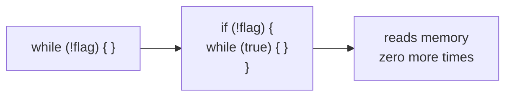
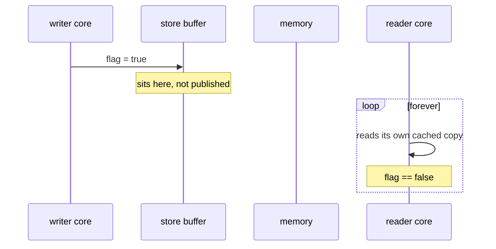
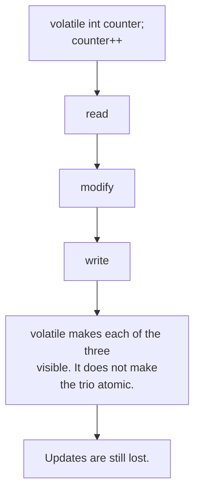

# Visibility: the loop that never ends

```java
boolean flag = false;                 // plain field

// reader thread                      // writer thread
while (!flag) { }                     Thread.sleep(300);
// never gets here                    flag = true;
```

## What the JIT is allowed to do

Nothing inside the loop writes `flag`, and no happens-before edge exists between the writer's store
and the reader's load. So the compiler may assume the value cannot change and hoist the read out:



That is not a bug in the JIT. It is the memory model permitting it, because you never asked for the
ordering that would forbid it.

Store buffers produce the same outcome with no compiler involvement:



## The fix

```java
volatile boolean flag;
```

A volatile write happens-before every later volatile read of the same field. That edge forbids both
the hoist and the stale read, so the reader is guaranteed to terminate.

```
$ ./gradlew runExample -Pexample=VisibilityExample
plain field    -> reader observed the write: false     <- still spinning
volatile field -> reader observed the write: true
```

## What volatile does NOT buy you



Visibility and atomicity are separate problems and need separate tools:

| Need | Reach for |
|---|---|
| visibility only | `volatile` |
| read-modify-write atomically | `AtomicInteger`, `LongAdder` |
| several fields consistent together | a lock |

> Source: `src/main/java/org/alxkm/memorymodel/VisibilityExample.java`
> The atomicity half: `src/main/java/org/alxkm/antipatterns/nonatomiccompoundactions/`
