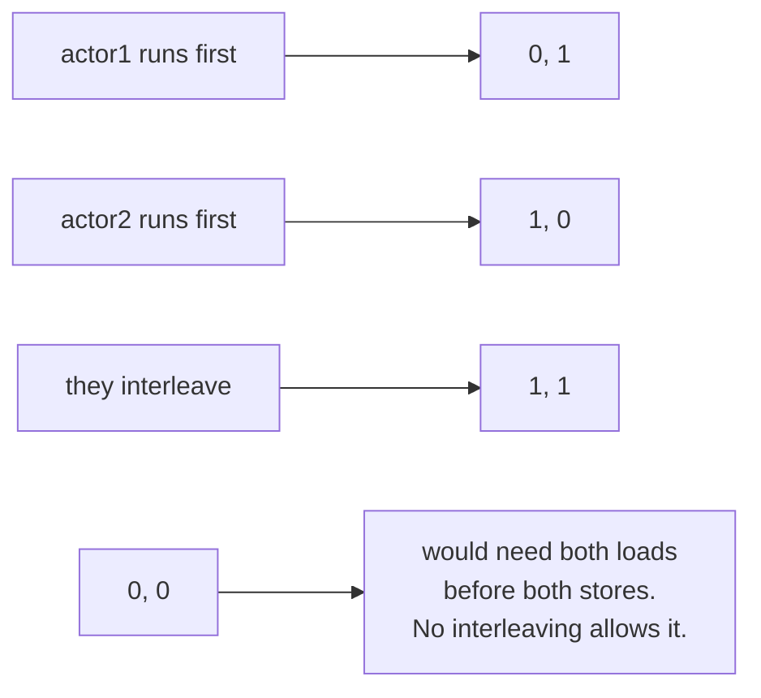
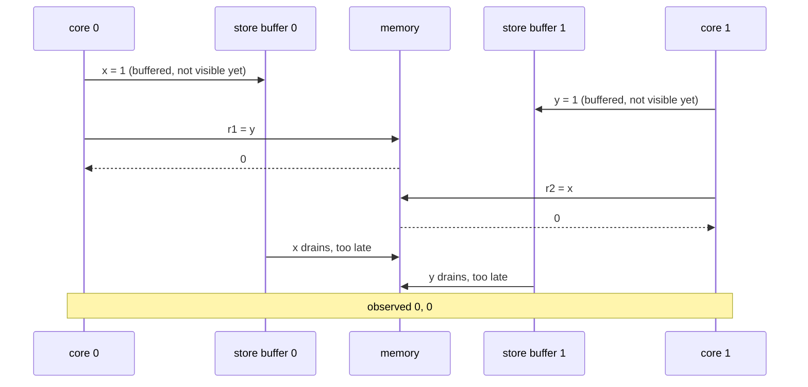
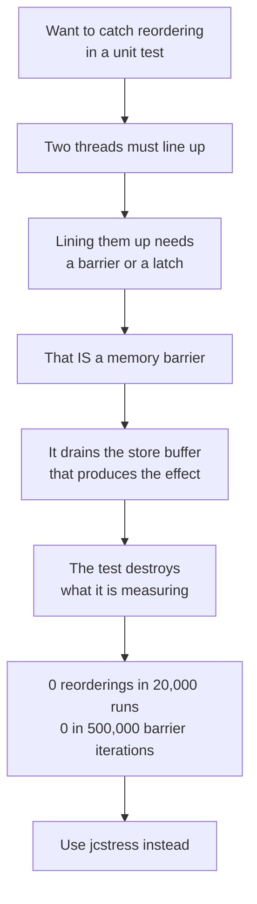

# Instruction reordering: the outcome the source forbids

Two threads, two plain fields, both starting at 0.

```
actor 1                      actor 2
-------                      -------
x = 1;                       y = 1;
r1 = y;                      r2 = x;
```

Read that literally and `(0, 0)` looks impossible:



## It happens anyway



The store sits in the writing core's buffer while that core proceeds to its load. Both loads can
execute before either store becomes visible. This is StoreLoad reordering, x86 does it, and the JMM
permits it because there is no happens-before edge between the two threads.

This is the concrete answer to "what does `volatile` actually prevent".

## Why this is not a unit test



jcstress spins the actors without synchronisation and samples in bulk:

| Result | Samples | Frequency | Expect |
|---|---|---|---|
| `0, 0` | **9,914,377** | **3.74%** | Interesting, the reordering |
| `0, 1` | 126,435,416 | 47.65% | Acceptable |
| `1, 0` | 128,998,594 | 48.61% | Acceptable |

Marking the fields `volatile` makes `0, 0` **FORBIDDEN**, and the run fails if it is ever seen. The
guarantee becomes something checked rather than asserted in prose.

Zero by hand, millions under jcstress. These bugs do not fail loudly in testing. They fail in
production, rarely, on someone else's hardware.

> Source: `src/jcstress/java/org/alxkm/memorymodel/ReorderingStressTest.java`, run with `./gradlew jcstress`
