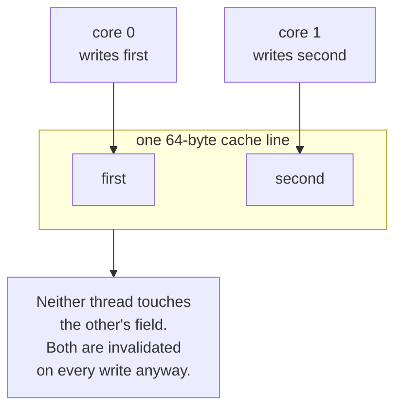
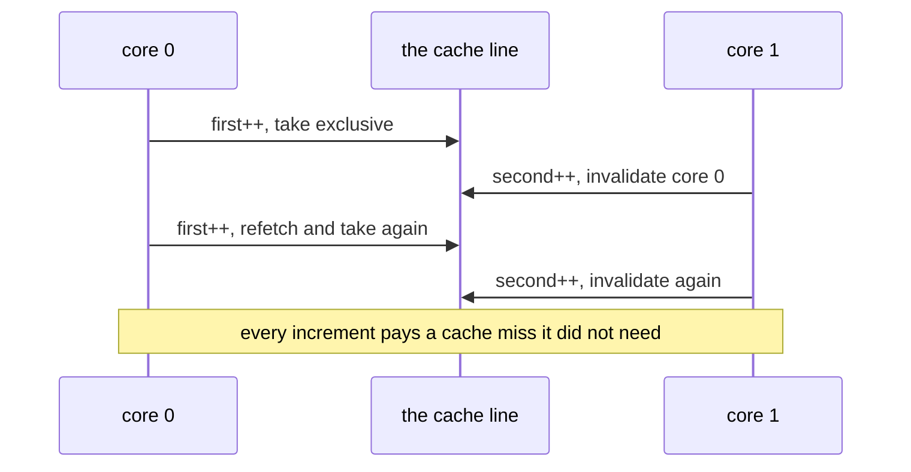
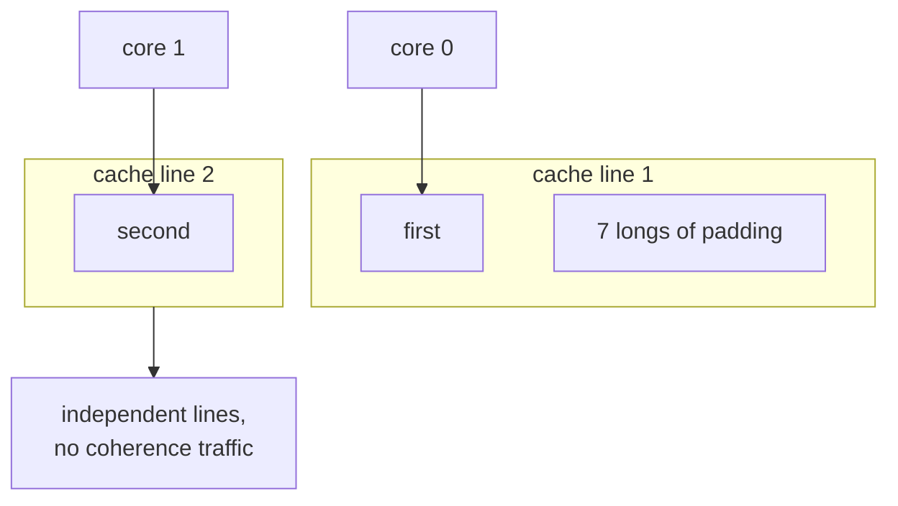
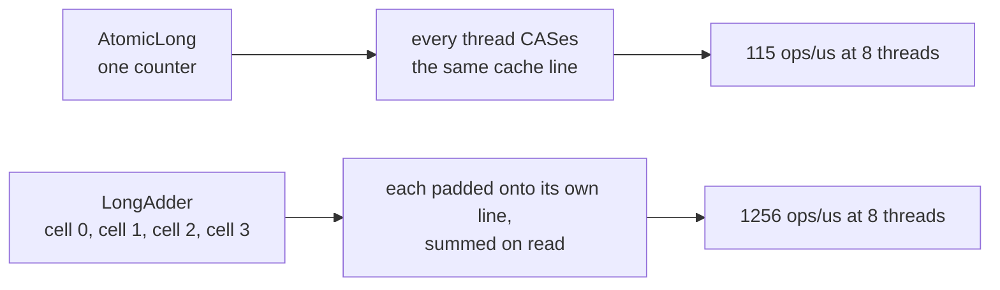

# False sharing: two fields, no contention, 2.8x slower

Caches move data in **lines**, typically 64 bytes, not in fields. Two fields on the same line are
one unit as far as the coherence protocol is concerned.

## The layout

## The ping-pong

## Padded apart

7 longs at 8 bytes each, plus the field itself, fills a 64-byte line, so `second` cannot land on
line 1.

## Measured here

50,000,000 increments per thread, 12 cores, both layouts compiled before anything is timed:

| Layout | Elapsed |
|---|---|
| adjacent | ~730 ms |
| padded | ~265 ms |

About **2.8x**.

> **Warm the JIT up first.** The earlier version of this demo timed the very first run of each
> layout and reported 3x. That was the adjacent loop being compiled, not a cache effect: the second
> round showed no difference at all. A real ratio and a warm-up artefact look identical from the
> outside.

Correctness is identical either way. Each counter is written by exactly one thread, so no increment
is ever lost. False sharing is purely a performance effect, which is what makes it easy to miss:
nothing is wrong, everything is just slow.

## Where you already rely on this

The catch: `sum()` walks every cell. A counter read as often as written is a different question.

Padding is not a general optimisation. It costs memory and only pays where different threads write
neighbouring fields hard. Measure first.

> Source: `src/main/java/org/alxkm/memorymodel/FalseSharingExample.java`
