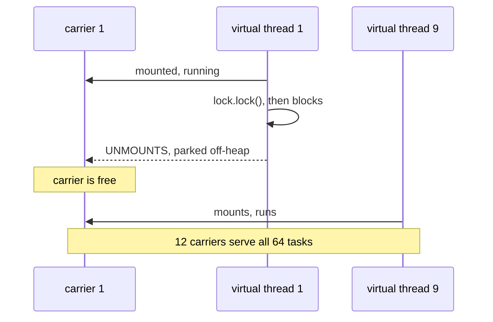
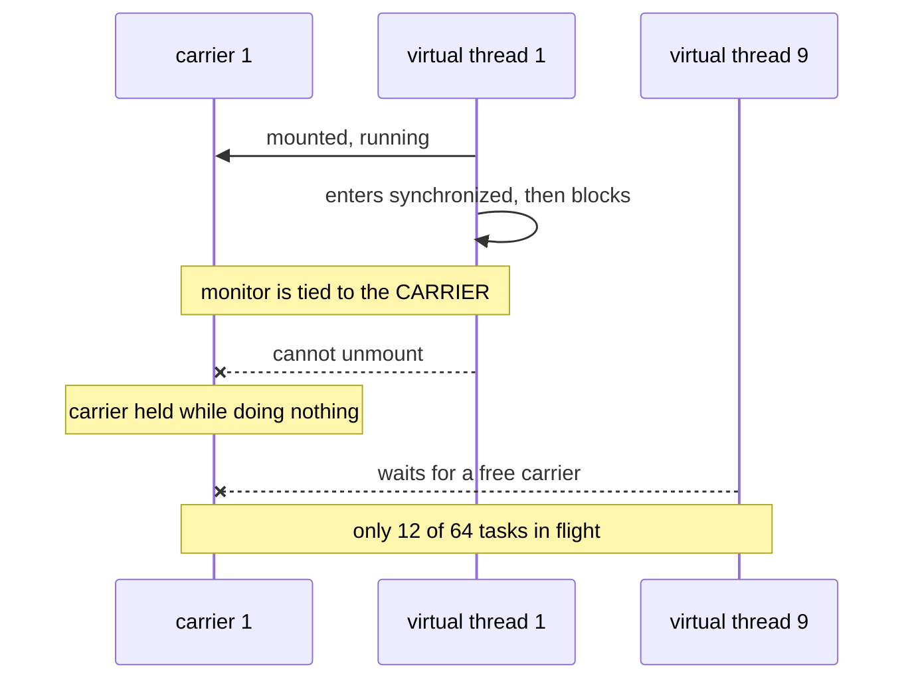
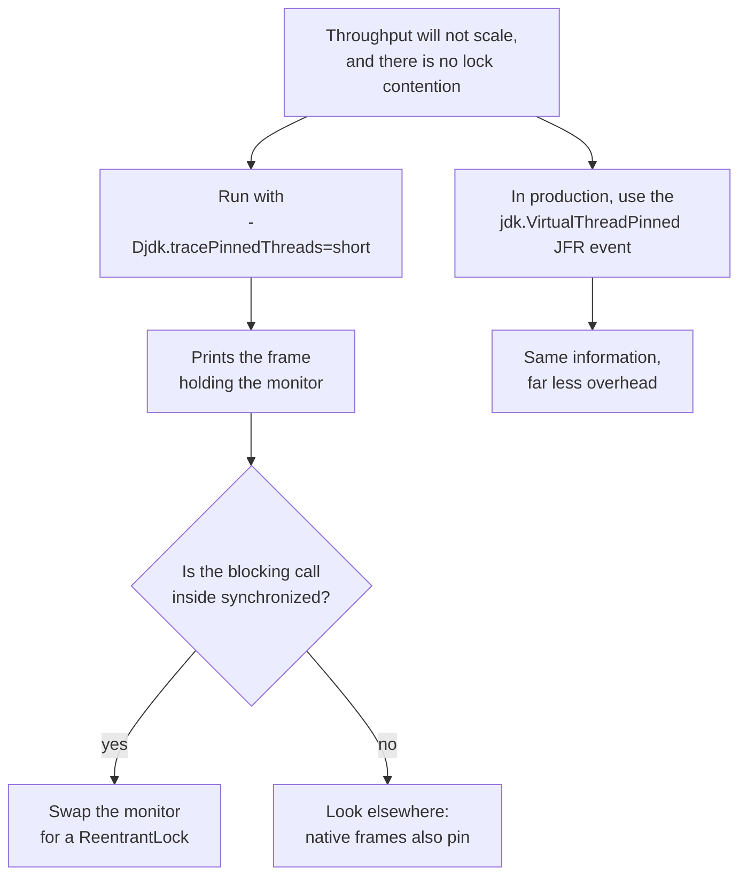

# Virtual thread pinning: where synchronized stops being free

A virtual thread that blocks normally **unmounts** from its carrier. That is the whole trick: a
handful of carriers serve thousands of virtual threads.

## Normal blocking



## Pinned, on Java 21



## Measured here

64 tasks, each blocking 500 ms, on 12 cores. Every task locks a monitor **of its own**, so there is
no lock contention at all.

| | Elapsed | Why |
|---|---|---|
| `synchronized` | **3060 ms** | 12 at a time, so six rounds |
| `ReentrantLock` | **503 ms** | all 64 at once |

About **6x**. What runs out is carriers, not locks. That is the part people miss when they look for
contention and find none.

## How to see it in your own code

Pinning is invisible in a thread dump. The symptom is throughput that refuses to scale.



```
Thread[#97,ForkJoinPool-1-worker-12,5,CarrierThreads]
    VirtualThreadPinningExample.lambda$runPinned$0(...) <== monitors:1
```

## The fix, and its expiry date

```java
synchronized (lock) {          ->      lock.lock();
    blockingCall();                    try { blockingCall(); }
}                                      finally { lock.unlock(); }
```

A virtual thread can hold a `ReentrantLock` across an unmount. Everywhere else `synchronized` is
fine, including when nothing blocks inside it.

| Version | Behaviour |
|---|---|
| Java 21, current LTS, what this repo builds against | pins, this matters |
| Java 24 and later, JEP 491 | no longer pins |

Check your target before rewriting anything.

> Source: `src/main/java/org/alxkm/diagnostics/VirtualThreadPinningExample.java`
