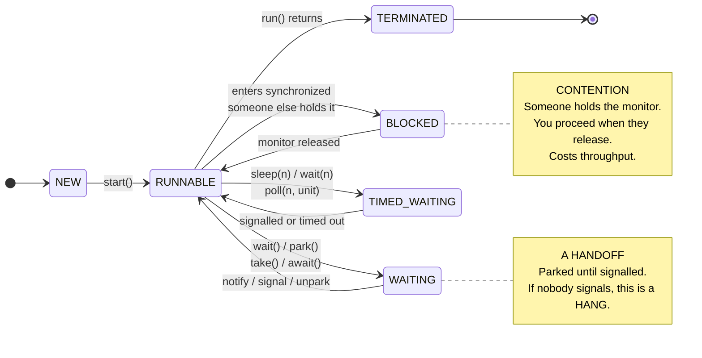

# Thread states: BLOCKED is not WAITING



| State | Means | Watch out for |
|---|---|---|
| `RUNNABLE` | running, or wants to be | also covers a blocking socket read, so it is not proof of a busy system |
| `BLOCKED` | waiting to enter a `synchronized` block | the dump names the monitor and its owner; many threads on one monitor is contention |
| `WAITING` | parked until signalled | if the signal never comes, the thread never returns |
| `TIMED_WAITING` | parked with a deadline | normal for idle pool workers |

## The trap

`ReentrantLock` **never** shows as `BLOCKED`. It parks the thread, so it appears as `WAITING` on an
ownable synchronizer. Grepping a dump for `BLOCKED` misses every lock in `java.util.concurrent`.

```
"contender"      id=23 BLOCKED
    waiting on java.lang.Object@6e2c634b held by "monitor-holder"          <- synchronized

"lock-contender" id=25 WAITING
    waiting on java.util.concurrent.locks.ReentrantLock$NonfairSync@20ad9418
        held by "lock-holder"                                             <- ReentrantLock
```

## Taking a dump

```bash
jcmd <pid> Thread.print     # preferred
jstack <pid>                # older, same idea
```

Take three, twenty seconds apart. One dump shows where threads are; three show whether they are
moving. A thread in the same frame across all three is stuck; one that moves is just busy.

> Source: `src/main/java/org/alxkm/diagnostics/ThreadDumpExample.java`
