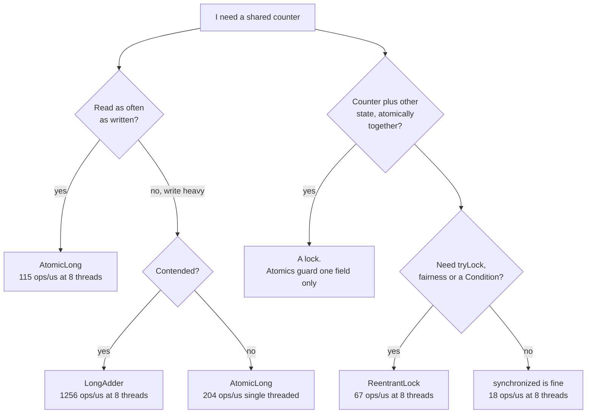
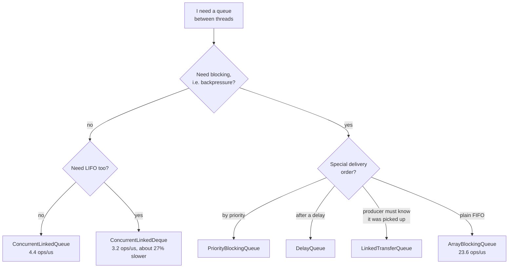
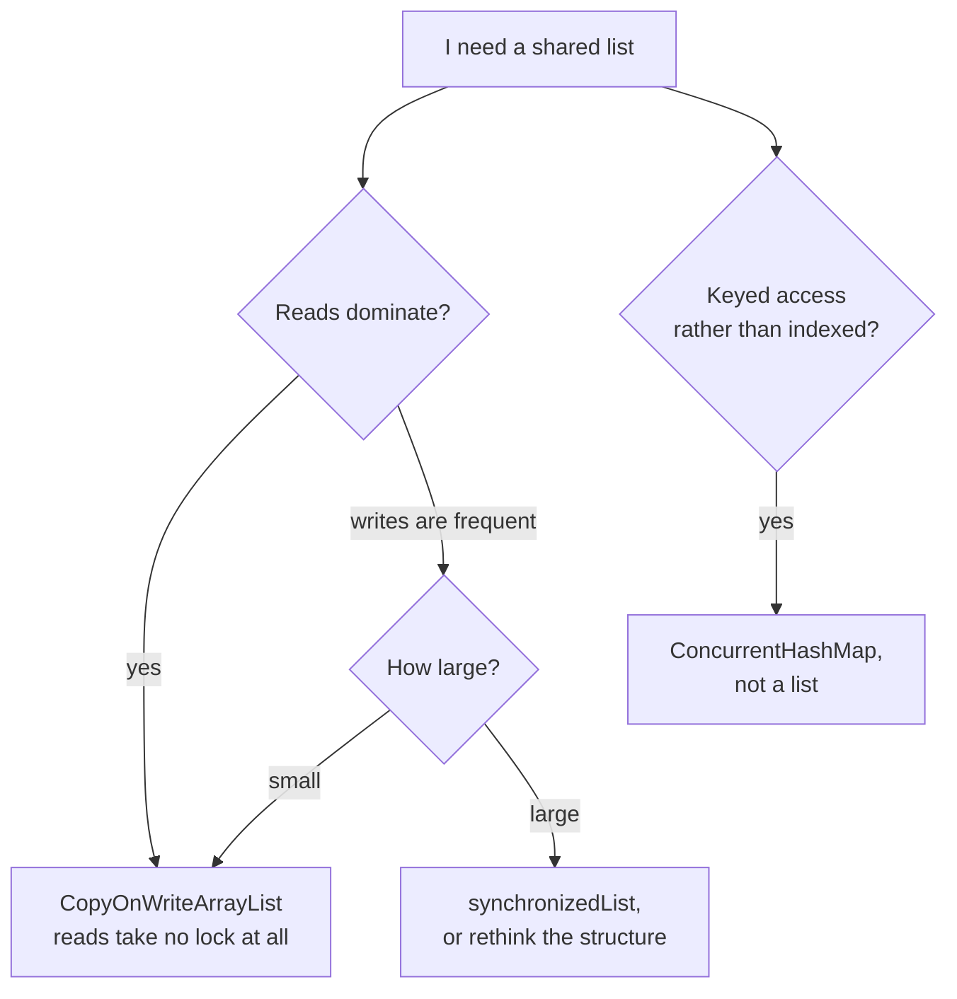
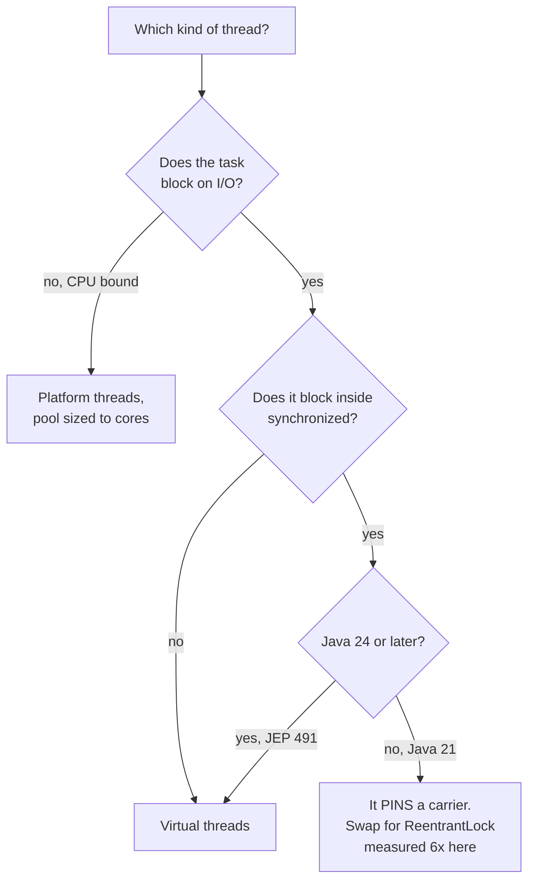

# Choosing: what to reach for, and what it costs

Every number here was measured in this repository. Reproduce with `./gradlew jmh`.

## A shared counter

| | 1 thread | 8 threads |
|---|---|---|
| `synchronized` | 92.9 | 18.2 |
| `ReentrantLock` | 96.1 | 66.6 |
| `AtomicLong` | 204.2 | 115.5 |
| `LongAdder` | 210.3 | **1256.5** |

Uncontended, the atomics are already about 2x ahead. The old advice that an uncontended monitor is
nearly free assumed biased locking, disabled in JDK 15 and removed in 18.

`LongAdder` wins by spreading its state across padded cells so threads stop fighting over one cache
line. The catch: `sum()` walks every cell, so a counter read as often as written is a different
question.

## A queue between threads

Note the last one. This README used to claim `LinkedBlockingQueue` is faster thanks to its two-lock
design. Measured, `ArrayBlockingQueue` was ahead both single-threaded (23.6 against 11.1) and with
four producers against four consumers (49.5 against 40.9 total, and the linked queue's error bar was
18.2 against 1.4). It allocates a node per element; the array queue reuses a ring buffer.

Bounded is a feature. An unbounded queue turns a slow consumer into an `OutOfMemoryError` instead of
backpressure.

## A shared list

1000 elements, group throughput in ops/us:

| | 7 readers, 1 writer | 4 readers, 4 writers |
|---|---|---|
| `CopyOnWriteArrayList` | 314.7 | 300.3 |
| `Collections.synchronizedList` | 19.3 | 12.4 |

"Useful when writes are infrequent" is right but understates it: even at an even split CopyOnWrite
was 24x ahead, because its reads take no lock and reads dominate the total. Read the write column
separately though: 4.1 against 5.8 at 1000 elements, and every write copies the whole array, so it
degrades with size.

## Virtual or platform threads

> Source: `src/jmh/java/org/alxkm/benchmark/`
