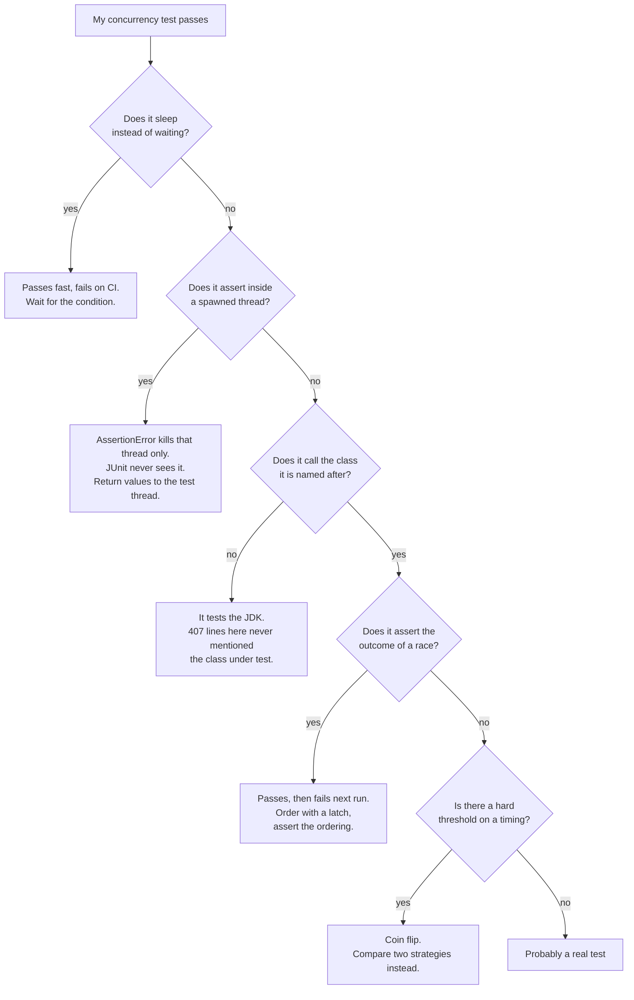
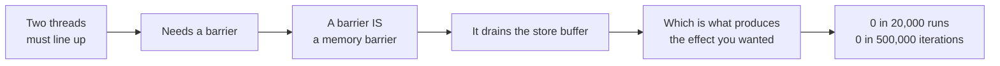
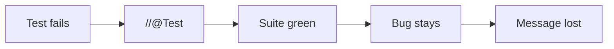

# How a concurrency test lies to you

Every failure below was found in **this** repository and fixed. That is the point of the list: these
are not hypotheticals, they are what a green suite looked like while the code was broken.

## The nine

| | Failure | Fix |
|---|---|---|
| 1 | `Thread.sleep(1000)` then assert | wait for the condition: `Await.until(...)` |
| 2 | `assertEquals` inside a spawned thread | return values, assert on the test thread |
| 3 | `assertTrue(x \|\| !x)`, a tautology | assert the property the code provides |
| 4 | test builds its own `AtomicInteger` and never calls the example | call the example; if it returns `void` and only prints, that is the bug |
| 5 | asserting which side of a race won | order the two with a latch |
| 6 | `assertTrue(cpuMillis > 50)` after a 100 ms spin | compare spinning against sleeping |
| 7 | using a barrier to catch reordering | the barrier drains the store buffer; use jcstress |
| 8 | `findDeadlockedThreads()` in an assertion | scope it: `deadlockedAmong(myThreads)` |
| 9 | `//@Test` | fix it, or `@Disabled` with a reason |

## Number 7 deserves its own picture

Against jcstress on the same idiom: 9,914,377 observations, 3.74% of samples. Know when your tool
cannot see the thing.

## Number 9 is the expensive one

Fourteen disabled tests were found here. Twelve were hiding one real bug: the Leader-Follower
pattern processed exactly one event and then spun forever. The tests had been right all along.

A commented-out `@Test` is invisible to every tool that could remind you. `@Disabled` with a reason
at least leaves a trace.

## The helpers

| | |
|---|---|
| `Await.until(description, condition)` | poll to a deadline, fail with a clear message |
| `Concurrently.run(threads, iters, task)` | start gate, so the operations actually overlap |
| `Concurrently.collect(threads, supplier)` | one result per thread, asserted on the test thread |

> Source: `src/test/java/org/alxkm/testsupport/`
