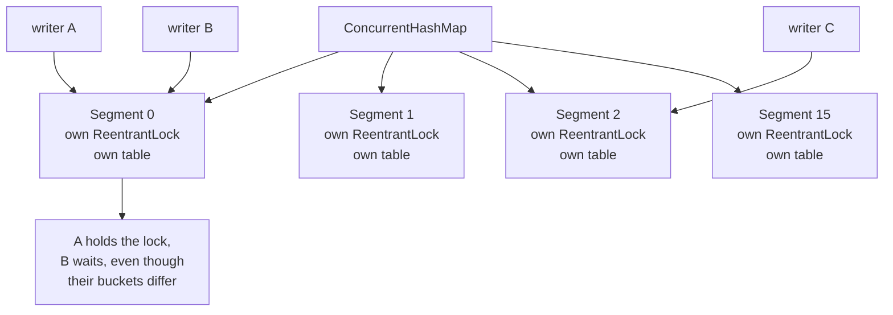
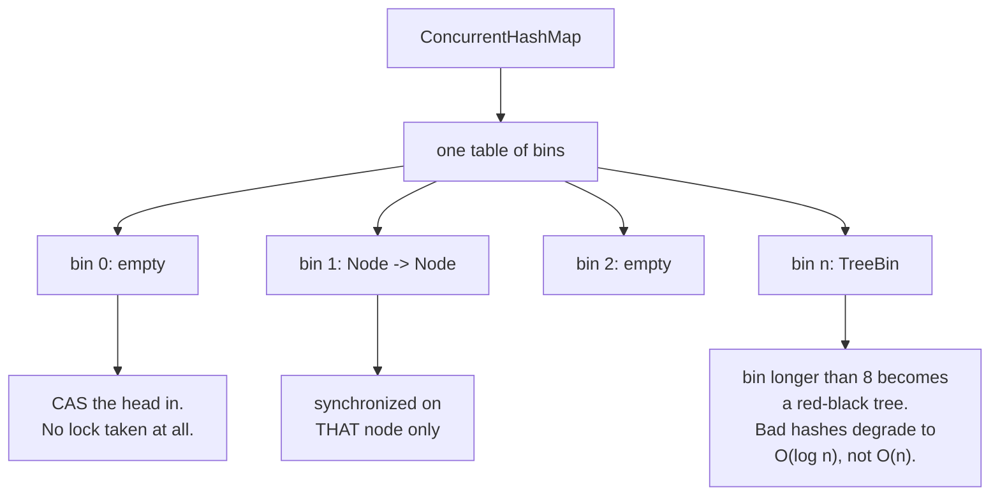
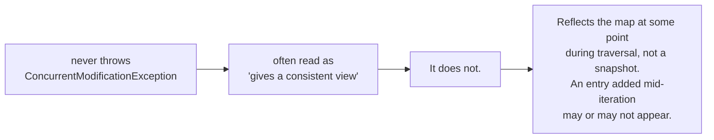
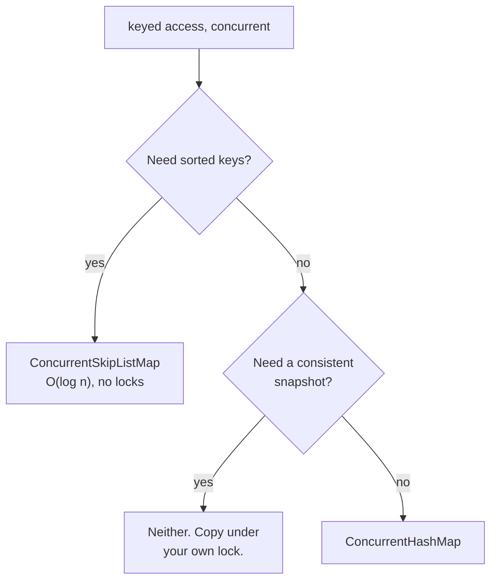

# ConcurrentHashMap: what changed in Java 8

The most repeated out-of-date fact in Java concurrency. This repository repeated it too, until the
text was corrected. `images/ConcurrentMap.png` still shows the Java 7 design.

## Java 7 and earlier: segments

A fixed array of mini hashtables, each with its own lock. `concurrencyLevel`, default 16, **set the
number of segments**.

Consequence: at most 16 writers could proceed at once, however large the map. Two keys landing in
the same segment blocked each other even with thousands of free buckets.

## Java 8 and later: no segments at all

The lock granularity is the **bin**, not a segment. Two writers collide only when their keys hash to
the same bucket, so concurrency scales with table size instead of being capped at 16.

`concurrencyLevel` still exists in the constructor, but it is now only a **sizing hint** for the
initial table. It no longer controls how many writers can proceed.

## Three details worth carrying

| | |
|---|---|
| empty bin | CAS, lock-free on the common path |
| occupied bin | `synchronized` on the first node |
| bin over 8 long | becomes a red-black tree, which is what makes hash collisions survivable |

`size()` is not a field. It is a striped counter summed on read, the same idea as `LongAdder`, which
is why it is an estimate under concurrent modification and `mappingCount()` is the long-returning
version to prefer.

## Iterators: unchanged, and still misunderstood

Both versions give **weakly consistent** iterators.

If you need a stable view, you have to build one.

## Choosing

Do not call `compute` or `merge` and then touch another map inside the lambda. The bin is locked
while your function runs; re-entering the same map can deadlock, and a slow lambda holds up every
writer hashing to that bin.

> README section "Scalable Maps". Replaces `images/ConcurrentMap.png`.
